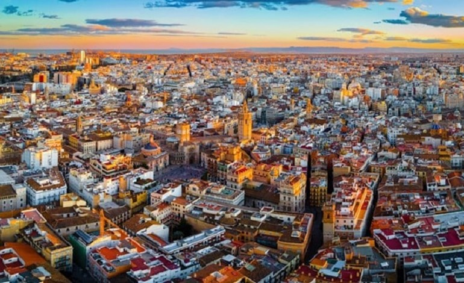

BP has launched plans for a green hydrogen cluster at its Castellón refinery, in the Valencia region of Spain. HyVal is a public-private collaborative initiative focused on the phased development of up to 2GW of electrolyser capacity by 2030 for producing green hydrogen to decarbonise BP’s refinery.

The project is critical to supporting decarbonisation across the Valencia region.