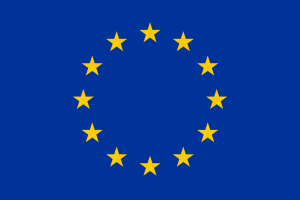

The European commission is taking its first step of an initiative announced by President Von der Leyen during her visit to Kyiv on 2 February 2023, by launching the “Ray of Hope” project with Enel. Enel will donate 5,700 solar photovoltaic panels of 350 Watt each, for a total capacity of around 2 MW. The panels will span up to 11,400 square metres of roofs split among public buildings.

The donation will provide electricity to schools, hospitals and fire departments, and the aim is that ultimately, Ukraine will be able to rely on clean electricity, produced at home.