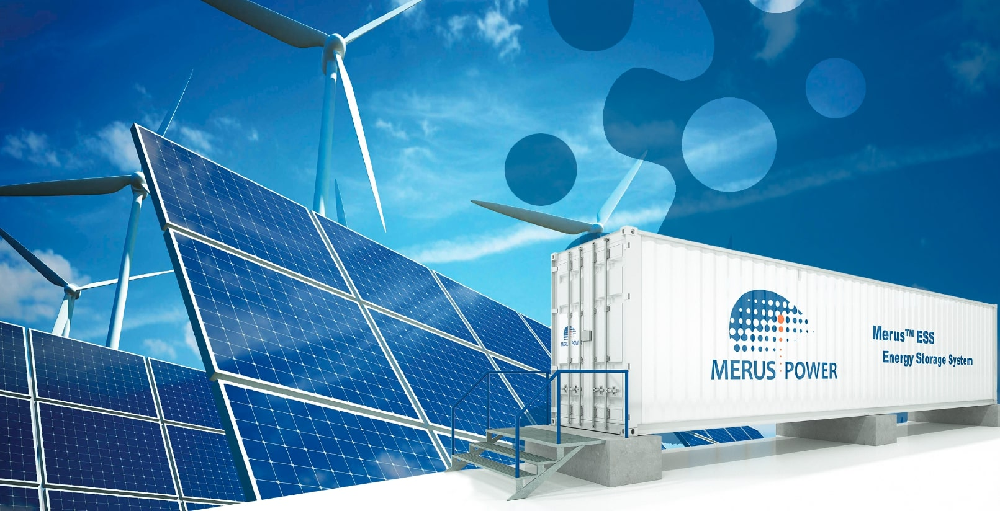

Developers Taaleri Energia and Merus Power have partnered to deploy a 30MW/36MWh battery energy storage system in Finland, one of the country’s largest. The battery unit will mainly support the balancing of production and consumption in the electricity grid through providing frequency reserve services to Transmission System Operator (TSO) Fingrid.

The companies said the project will be the largest energy storage unit operating in frequency reserve by capacity (MWh) in Finland.