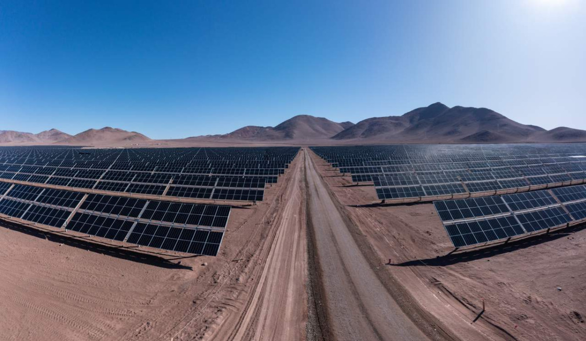

Enel Green Power Chile, the renewable branch of Enel Chile, has begun commercial operation of its 375MW Campos del Sol PV power plant after gaining official authorisation. Campos del Sol consists of one million solar panels with bifacial monocrystalline PV technology capable of generating around 12% more electricity than conventional panels.

The purpose of the project is to increase the use of energy from renewable sources to accelerate the energy transition and decarbonisation.