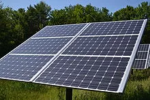

Husk Power, the company that pioneered the minigrid industry 15 years ago, has become the first  to own over 200 community solar minigrids in Africa and Asia, with a rollout of around 16 units per month. The company plans to double its endeavour to 400 minigrids by the end of 2023, while also expanding their operations in Sub-Saharan Africa. 

The main aim of the project is to scale the minigrid industry in order to ultimately achieve universal electrification in Asia and Africa,and provide access to modern, affordable, clean, reliable energy for all.