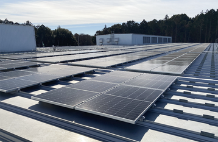

Japanese ISP Internet Initiative Japan Inc. has installed solar panels at one of its data centres. The company announced the installation of a 336kWp rooftop solar power system on the data hall and administrative buildings at its Shiroi data centre campus in Chiba Prefecture.

The panels are expected to generate approximately 373MWh annually, amounting to 3% of the facility’s needs to help take control of carbon dioxide emissions.