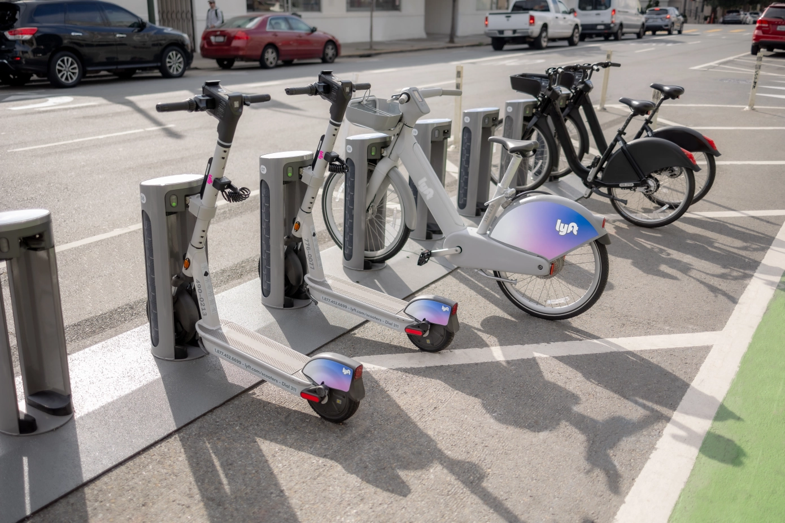

In order to establish a more organised, shared micromobility landscape, Lyft has unveiled a next-generation dockable e-scooter and updated docking stations. Last year, the company acquired PBSC Urban Solutions, a Canadian supplier of bikeshare equipment and technology, more than doubling its micromobility footprint. As a result, Lyft has the potential to retrofit some of its existing 100,000 bike docks to accommodate the new scooters.

