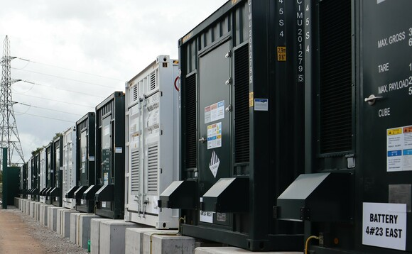

A new 100MW Battery in Capenhurst, Chester, estimated to be the largest in Europe, has gone live, marking another milestone for the fast-expanding energy storage sector. Owner and operator Zenobē announced the battery unit is forecast to cut emissions by over one million tonnes over the next 15 years, while also saving an estimated £58m in curtailment costs that would have previously been passed on to consumer bills.

The site will support the increasing deployment of renewables projects in the region and help manage network capacity, in order to maximise the use of clean power generated by local wind farms.